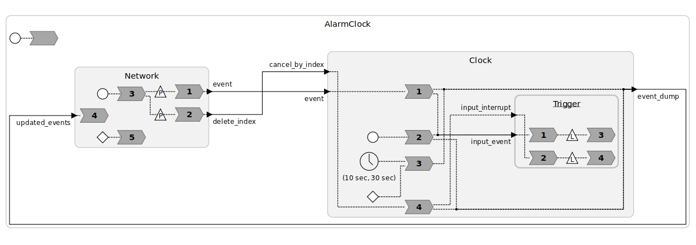

Lingua Franca Alarm Clock
----------------------------

**Author:** <revol-xut@protonmail.com>

A small alarm clock which is written using the scheduling and time features from Lingua Franca.
This requires [installing Crow](https://crowcpp.org/master/getting_started/setup), which provides the HTTP server implementation.



## Installation

By default the AlarmClock expects the sound files to be placed in `~/music/AlarmClock/` you can change this
path by editing the `shared_header.cpp` file. Furthermore is it possible to configure paths to other binaries
in this file e.g. kill, mpg321 -commands. 

This program requires that you first [install Crow](https://crowcpp.org/master/getting_started/setup).
If you have installed Crow in a location where CMake does not automatically find it, then you can manually specify the location when compiling the LF program as follows:

```bash
    $ CMAKE_PREFIX_PATH=<install-location> lfc ./AlarmClock.lf
```

## Usage

Running the program starts a web server on localhost at port 8680. The commands it understands are:

### /list **GET**
Returns a list of upcoming events.

```json
    "timestamp": {
        "date": ""
        "message": ""
    }
```

**Examples**

```
$ curl http://0.0.0.0:8680/list
```

### /stop **GET**
Stops the currently playing alarm sound.

```json
{
    "success": "exit code"
}
```

**Examples**

```
$ curl http://0.0.0.0:8680/stop 
```

### /add\_event\_timestamp **POST**
Will schedule your alarmclock for the given timestamp

Request:
```json
{
    "message": "",
    "time_stamp": 0
}
```
Response:
```json
{
    "success": true
}
```

**Examples**

```
$ curl http://0.0.0.0:8680/add_event_timestamp -X POST -H "Content-Type: text/json" -d '{"message": "test", "time_stamp": 1643400000}'
```

Schedules event for given timestamp.

### /add\_event\_relative **POST**
Will schedule a event relative to the current time.

Request
```json
{
    "days": 0,
    "hours": 0,
    "minutes": 0,
    "seconds": 0 
}
```

Response:
```
{
    "success": true
}
```

**Example**

```
$ curl http://0.0.0.0:8680/add_event_relative -X POST -H "Content-Type: text/json" -d '{"hour": 6, "minute":0, "second": 0, "message": "hello"}'
```

Schedules sets your alarmclock to activate in 6 hours. 

### /add_event_time **POST**
Schedule event for this time in the next 24 hours. If a parameter
is unspecified the current time is used.

Request
```json
{
    "hour": 0,
    "minute": 0,
    "second": 0
}
```

Response:
```json
{
    "success": true
}
```
**Example**

```
    $ curl http://0.0.0.0:8680/add_event_time -X POST -H "Content-Type: text/json" -d '{"message": "test", "hour": 6, "minute":0, "second": 0, "message": "hello"}'
```

Schedules the event for the next time the given time occures.
